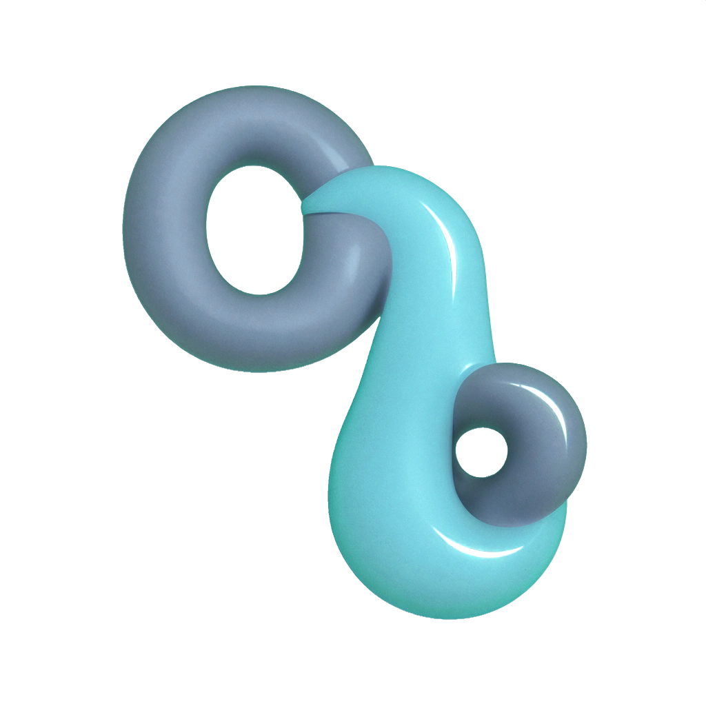
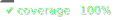

# GHEX

Github Extractor CLI

<div align="center">
    
</div>


List github repositories or download individual files or whole repos conveniently. Faster than clone depth=1 for an entire repo and much faster if you just need a single file

See an Asciinema video of usage (including with [fzf](https://github.com/junegunn/fzf)) here: https://bn-l.github.io/GithubExtractor/cli/
 
<div align="center" style="display: flex; justify-content: center; gap: 10px;">
   <a href="coverage/coverage.txt"></a>  <a href="https://github.com/bn-l/GithubExtractorCLI/issues"></a>  <a href="https://docs.github.com/en/pull-requests/collaborating-with-pull-requests/proposing-changes-to-your-work-with-pull-requests/creating-a-pull-request">  </a>
</div>


<!-- ABOVE SNIP -->


# Quickstart

Install [node](https://nodejs.org/en/download) then:

```bash
npx ghex -h
```

Or:

```bash
npm install -g ghex
```

## Usage


```bash
ghex [options] <paths...>
```

## Arguments

### paths

One or more paths to download. Can be a whole 
repo, a folder or a file. Supports globs but the path should be quoted.
To exclude use a negative glob ("!" at the beginning).
Can mix paths from different repos (conflicts resolved
left to right). A trailing slash means a whole folder.


## Options

### -l, --list 

List files. Useful as a dry run and with fzf. Does not
download. Will show show conflicts for the current 
working directory if -d / --dest is not specified.

### -c, --conflicts-only  

Only show conflicts when listing.

### -d, --dest folder   

Destination folder. Defaults to the current directory.

### -i, --case-insensitive      

Ignores case when checking for conflicts. Default is 
case-sensitive--i.e. casing matters.

### -k, --keep-if condition   

"newer" | "existing". Will keep conflicting files 
if they exist or are newer. WARNING: The
default is to overwrite existing silently.

### -q, --quiet    

No success or error messages.     

### --colors    

Use ansi escape characters to color output.
Default true but respects the NO_COLOR env var if set. 

## Downloading Examples:

Entire repo:
```bash             
npx ghex facebook/react
```
Specific folder:
```bash
npx ghex "facebook/react/packages/*"
```
Specify destination:
```bash
npx ghex -d local/dest facebook/react
```
Specific files
```bash
npx ghex facebook/react/.circleci/config.yml  facebook/react/.github/stale.yml
```
Different repos mixed together"
```bash
npx ghex facebook/react  micromatch/picomatch
```


### Listing Examples:

Only conflicts
```bash
npx ghex -lc -d local/dest  facebook/react
```
Specific folder
```bash
npx ghex -l "facebook/react/.circleci/*"
```


<!-- Everything after the snip is snipped off -->
<!-- SNIP -->
